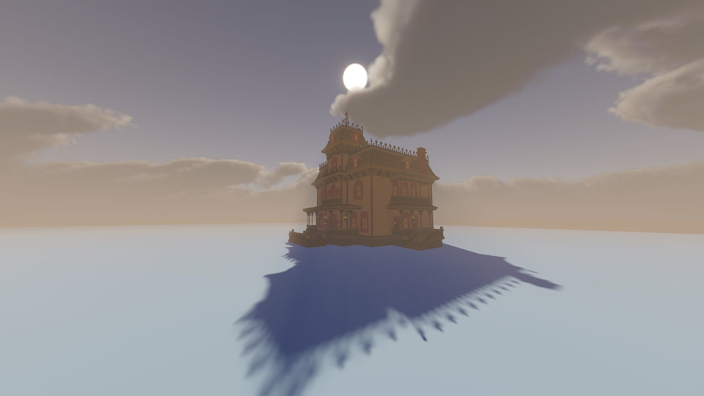

# Voxelore

An Open-source highly-optimized Unity Voxel game Engine.

Currently apart of a game I'm working on, it'll be split up into its own package when it's more mature.

> A Rendering of the "haunted mansion" model from [here](https://github.com/kluchek/vox-models). Everything in this screenshot is rendered with Voxels (including the floor). No Raytracing.

Currently WIP, will be improved as I develop my game.

## Unity Requirements

Built off the Unity version 2022.1.12f1, but since currently it's just a pile of scripts, it should work with earlier versions and later versions alike for sure.

Requires Unity.Burst and Unity.Collections

## Supported Formats

Supports loading MagicaVoxel .vox files at the moment (Version 150-200, correctly loads bigger worlds with transformations applied correctly, atleast as far as my testing goes)

## Technical Details

The Voxel scale is a 16th of a meter. Essentially think of it like a single pixel in Minecraft = one Voxel in this Engine. Each Chunk is a cubic area 32x32x32 Voxels in size. However Chunks aren't rendered directly, they are more of a CPU construct to help with the dynamic abilities of the world (placing and destroying Voxels). What gets rendered are "Super Chunks" which are 8x8x8 *Chunks* in size. This optimizes draw calls significantly, without it, Voxels this small would be very very laggy to render. The benefit of this system is the smaller chunk meshes that get combined still are meshed in parallel on the CPU, however what gets uploaded to the GPU ends up being much more optimized by being batched together. The drawback of course, is when only one Chunk within the Super Chunk is changed, the entire Super Chunk has to be re-combined. However, it does not have to remesh all the Chunks, just recombine the already loaded Chunk Meshes. this drawback is well worth it, as without batching the GPU just can't keep up.

This Engine actually isn't designed with procedural generation in mind like most Voxel engines (though with changes it could be made to fit that). Instead, it's designed more with wide-open bigger levels in mind, but not infinite procedural ones. Evident by the fact that there is no concept of render-distance. The entire world is present in the Scene at once. It relies on Frustum-Culling to optimize the drawing of such a Scene, however there is no dynamic loading and unloading of chunks, as it is designed for non-procedural, hand-crafted levels.

## License

The License is MIT, meaning you can pretty much do anything with this code if you like, just make sure to keep the copyright notice and don't claim *all* of the code as your own (If you make substantial changes however, those are indeed yours).
